[Stanford CS236: Deep Generative Models I 2023](https://www.youtube.com/playlist?list=PLoROMvodv4rPOWA-omMM6STXaWW4FvJT8)
## **1. Introduction**
[INTRODUCTION](https://deepgenerativemodels.github.io/notes/introduction/)

### 1.1 **Density Estimation**
Density estimation refers to a model's ability to evaluate the probability density function  for a data point . Generative models are categorized into _explicit density models_ and _implicit density models_ based on whether or not they provide an explicit formula for the density function.

- **Explicit Models**: These models allow direct computation or approximation of . Examples include Variational Autoencoders (VAEs) and Energy-Based Models (EBMs). VAEs use a lower bound on the density, while EBMs approximate it.
    
    For explicit models:
    
    where  is a latent variable representing a compressed representation of . In VAEs, this is approximated by a variational lower bound.
    
- **Implicit Models**: These models, such as Generative Adversarial Networks (GANs), do not directly compute  but can generate samples that approximate the data distribution. GANs focus on learning a mapping from a simple distribution  to the data space without defining .
    

### 2.1 **Sampling**

Sampling addresses whether a model can generate new samples from the learned distribution, , and the efficiency of this process.

- **Fast Sampling Models**: Directed probabilistic graphical models (PGMs), VAEs, and GANs are known for efficient sampling due to their straightforward forward passes.
    
    - **VAE**: Sampling from VAEs involves drawing , then generating  by decoding  through a decoder network .
        
    - **GAN**: GANs generate  through the generator network as  by sampling , typically a standard Gaussian.
        
- **Slow Sampling Models**: Undirected PGMs, EBMs, Autoregressive (AR) models, diffusion models, and flow-based models are typically slower, requiring iterative steps like Markov Chain Monte Carlo (MCMC) or reversible transformations.
    

### 3.1 **Training**

Training methods for generative models differ based on tractability and objectives. The primary methods include _maximum likelihood estimation_ (MLE), _variational lower bounds_, and _adversarial training_.

- **Exact MLE**: Some models, like Autoregressive (AR) models and flow-based models, support exact MLE by maximizing the likelihood function:
    
    where  represents data points, and  are the model parameters.
    
- **Approximate Likelihood**: For VAEs, we maximize a variational lower bound, often referred to as the Evidence Lower Bound (ELBO):
    
    where  is the approximate posterior and  denotes the Kullback-Leibler divergence.
    
- **Adversarial Training**: In GANs, the generator and discriminator are trained in a minimax game:
    
    where  is the discriminator's estimate of the probability that  is real.
    
- **Minimax Training for EBMs**: Energy-Based Models (EBMs) can use a minimax objective, making training challenging due to instability and lack of clear objective functions.
    

### 4.1 **Latents**

The use of latent variables  in generative models varies:

- **Latent-Variable Models**: VAEs, GANs, and some EBMs use latent variables. The latent space  can either be of the same dimension as  or a compressed representation.
    
    - For VAEs:
        
        where  is often sampled from a standard Gaussian.
- **Non-Latent Models**: Autoregressive models and flows do not use latent variables in the same sense but can still model complex distributions through transformations.

# 2. **Variational Autoencoders**
Variational Autoencoders (VAEs) are a class of generative models that use deep learning techniques to learn probabilistic latent representations of data. They build upon standard autoencoders but incorporate probabilistic reasoning using [[HHU/Generative Models/Variational Inference (VI)]] to allow meaningful latent space interpolation and structured data generation.

## 2.1 Intuition Behind VAEs
A standard autoencoder consists of an encoder $q_\phi(z | x)$ that compresses input data x into a latent representation z and a decoder $p_\theta(x | z)$ that reconstructs x from z. However, autoencoders suffer from two major issues:
- The latent space may be discontinuous and poorly structured.
- The encoder is deterministic and lacks probabilistic reasoning.

VAEs address these issues by **learning a probability distribution over latent variables** instead of deterministic mappings. Instead of mapping an input x to a single z, we learn a **distribution** $q_\phi(z | x)$from which we sample. This results in a structured, smooth latent space that enables meaningful data generation.

## 2.2. Mathematical Formulation

Let's derive the training objective of the VAE:
$$\log p_\theta(x) = \log \int_z p_\theta(x, z) dz$$

We begin with the log likelihood we want to maximize:
$$\log p_\theta(x) = \log \int_z p_\theta(x | z) p(z) dz$$

This integral is intractable, so we introduce a [variational approximation](https://ermongroup.github.io/cs228-notes/inference/variational/#:~:text=The%20main%20idea%20of%20variational,is%20most%20similar%20to%20p%20.) $q_\phi(z|x)$ to the true posterior:

$$\log p_\theta(x) = \log \int_z p_\theta(x | z) p(z) \frac{q_\phi(z|x)}{q_\phi(z|x)} dz$$
$$\log p_\theta(x) = \log \mathbb{E}_{z \sim q_\phi(z|x)}\left[\frac{p_\theta(x | z) p(z)}{q_\phi(z|x)}\right]$$
Now we can apply [Jensen's inequality](https://en.wikipedia.org/wiki/Jensen%27s_inequality) because log is a concave function: 

$$\log p_\theta(x) = \log \mathbb{E}_{z \sim q_\phi(z|x)}\left[\frac{p_\theta(x | z) p(z)}{q_\phi(z|x)}\right] \geq \mathbb{E}_{z \sim q_\phi(z|x)}\left[\log\frac{p_\theta(x | z) p(z)}{q_\phi(z|x)}\right]$$

Let's expand the expectation term:

$$\mathbb{E}_{z \sim q_\phi(z|x)}\left[\log\frac{p_\theta(x | z) p(z)}{q_\phi(z|x)}\right] = \mathbb{E}_{z \sim q_\phi(z|x)}\left[\log p_\theta(x | z) + \log p(z) - \log q_\phi(z|x)\right]$$

This can be rearranged as:

$$\mathbb{E}_{z \sim q_\phi(z|x)}\left[\log p_\theta(x | z)\right] - \mathbb{E}_{z \sim q_\phi(z|x)}\left[\log \frac{q_\phi(z|x)}{p(z)}\right]$$

The second term is the KL divergence between $q_\phi(z|x)$ and $p(z)$:

$$\mathbb{E}_{z \sim q_\phi(z|x)}\left[\log p_\theta(x | z)\right] - D_{KL}(q_\phi(z|x) || p(z))$$

The first term is the **reconstruction loss**, and the second term is the **regularization term** that encourages the approximate posterior to be close to the prior. This lower bound on the log-likelihood is called the Evidence Lower Bound (ELBO):

$$\log p_\theta(x) \geq \mathcal{L}(\theta, \phi; x) = \mathbb{E}_{z \sim q_\phi(z|x)}\left[\log p_\theta(x | z)\right] - D_{KL}(q_\phi(z|x) || p(z))$$

In the VAE, we typically choose: $p(z) = \mathcal{N}(0, I)$ (standard normal prior)

---

The integral over the posterior appears in the **expectation term** of the ELBO:
$$\mathbb{E}_{q_\phi(z | x)} [\log p_\theta(x | z)].$$

This expectation is **intractable** because it requires integrating over the approximate posterior $q_\phi(z | x)$. The trick used to make it tractable is called the **Reparameterization Trick**.

### Why Is the Integral Intractable?

The expectation is written as:
$$\mathbb{E}_{q_\phi(z | x)} [\log p_\theta(x | z)] = \int q_\phi(z | x) \log p_\theta(x | z) dz.$$

The problem is that $q_\phi(z | x)$ is typically a **complex, high-dimensional distribution**, making direct sampling difficult. If we sample directly from $q_\phi(z | x)$, gradients with respect to $\phi$ cannot be computed easily.

---

## 2.3 The Reparameterization Trick

To enable gradient-based optimization (backpropagation), we **reparametrize z in terms of a differentiable transformation of a noise variable** that is independent of $\phi$.

For example, if $q_\phi(z | x)$ is a Gaussian:

$$q_\phi(z | x) = \mathcal{N}(z; \mu_\phi(x), \sigma_\phi^2(x))$$

where $\mu_\phi(x)$ and $\sigma_\phi(x)$ are the encoder outputs, we reparametrize z as:

$$z = \mu_\phi(x) + \sigma_\phi(x) \cdot \epsilon, \quad \epsilon \sim \mathcal{N}(0, I).$$

Now, instead of sampling directly from $q_{ϕ}(z∣x)$, we sample $ϵ$ from a standard normal $\mathcal{N}(0, I)$ (which is independent of ϕ), and transform it into z. This allows gradients to flow through $\mu_\phi(x)$ and $\sigma_\phi(x)$, enabling efficient training using **stochastic gradient descent (SGD)**.

---

### Why This Trick Works

1. **Gradient Flow**: Since $\epsilon$ is sampled from a fixed distribution $\mathcal{N}(0, I)$, the transformation $z = \mu_\phi(x) + \sigma_\phi(x) \cdot \epsilon$ allows gradients to pass through $\mu_\phi(x)$ and $\sigma_\phi(x)$ during backpropagation.
    
2. **Monte Carlo Approximation**: Instead of computing the expectation as an integral, we approximate it using Monte Carlo sampling:
    
    $$\mathbb{E}_{q_\phi(z | x)} [\log p_\theta(x | z)] \approx \frac{1}{L} \sum_{i=1}^{L} \log p_\theta(x | z^{(i)}),$$
    
    where $z^{(i)} = \mu_\phi(x) + \sigma_\phi(x) \cdot \epsilon^{(i)}$, with $\epsilon^{(i)} \sim \mathcal{N}(0, I)$
    
3. **Allows Differentiability**: Because the sampling operation is **now outside the learnable parameters**, it does not block gradient computation.

```python
    def reparameterize(self, mu, log_var):

        std = torch.exp(0.5 * log_var)

        eps = torch.randn_like(std)

        return eps * std + mu
    
    def forward(self, x):

        mu, log_var = self.encoder(x)

        z = self.reparameterize(mu, log_var)

        x_hat = self.decoder(z)

        return x_hat, mu, log_var

```
### Why $\log\sigma^2$?
✅ **Ensures $\sigma^2$ is always positive** (without constraints on network output).  
✅ **Improves numerical stability**, avoiding issues with very small or large variances.  
✅ **Allows stable learning**, preventing exploding/vanishing gradients.  
✅ **Makes KL divergence computation easier and efficient**
## 2.4 Understanding the ELBO Components

1. **Reconstruction Term:**$$\mathbb{E}_{q_\phi(z | x)} [\log p_\theta(x | z)]$$
    - This encourages the decoder $p_\theta(x | z)$ to **reconstruct the input x** given a sampled latent variable z.
    - Intuitively, this term measures how well the generated samples match the real data.
    - If this term is too low, the VAE produces blurry or poor reconstructions.

2. **Regularization (KL Divergence) Term:**$$D_{\mathrm{KL}}(q_\phi(z | x) \| p(z))$$
    - This ensures that the approximate posterior $q_\phi(z | x)$ stays **close to the prior $p(z)$** (often chosen as a standard normal $\mathcal{N}(0, I)$.
    - Encourages smooth and structured latent space, **preventing overfitting**.
    - If this term is too high, the latent space collapses to the prior, losing meaningful representations.

The KL divergence term has a closed-form solution when both distributions are Gaussian:

$$D_{KL}(q_\phi(z|x) || p(z)) = \frac{1}{2}\sum_{j=1}^J\left(\sigma_j^2 + \mu_j^2 - \log(\sigma_j^2) - 1\right)$$

Where $\mu_j$ and $\sigma_j^2$ are the mean and variance parameters for each dimension of the latent space.

``` python
    def loss_function(self, x_hat, x, mu, log_var, recons_weight=1.0):

        recons_loss = F.mse_loss(x_hat, x, reduction='sum')

        kld_loss = -0.5 * torch.sum(1 + log_var - mu.pow(2) - log_var.exp())

        loss = recons_weight * recons_loss + self.beta * kld_loss
```

## 2.5 Effect of Upweighting/Downweighing the KL Term ([β-VAE](https://openreview.net/forum?id=Sy2fzU9gl))

If we modify the ELBO with a **β-weighting factor**:
$$\mathcal{L}_\beta(\theta, \phi; x) = \mathbb{E}_{q_\phi(z | x)} [\log p_\theta(x | z)] - \beta D_{\mathrm{KL}}(q_\phi(z | x) \| p(z))$$

- **β > 1 (Upweighting KL)** → **Stronger Regularization**
    - The model prioritizes **latent space structure over reconstruction quality**.
    - Leads to a more disentangled latent space (each latent dimension learns independent, meaningful features).
    - However, high β forces the posterior too close to the prior, making reconstructions blurrier.
    
- **β < 1 (Downweighting KL)** → **Better Reconstructions, Weaker Latent Space Regularization**
    - The model focuses more on reconstruction accuracy and less on ensuring a structured latent space.
    - Can lead to **overfitting** (each latent dimension carries too much data-specific information).
    - If β → 0, the model behaves more like a regular autoencoder, ignoring the generative aspect.
###### This β-VAE approach is useful in applications like **disentangled representation learning**, where we want latent dimensions to capture independent factors of variation (e.g., shape, color, rotation).
---

Let's derive the KL divergence expression:
$$D_{KL}(q(z)||p(z|x;\theta)) = -\sum_z q(z)\log p(z,x;\theta) + \log p(x;\theta) - H(q) \geq 0$$Starting with the definition of KL divergence:
$$D_{KL}(q(z)||p(z|x;\theta)) = \sum_z q(z)\log\frac{q(z)}{p(z|x;\theta)}$$Expanding the logarithm:
$$D_{KL}(q(z)||p(z|x;\theta)) = \sum_z q(z)\log q(z) - \sum_z q(z)\log p(z|x;\theta)$$The first term is the negative entropy of $q$: $$-H(q) = \sum_z q(z)\log q(z)$$For the second term, applying Bayes' rule: $$p(z|x;\theta) = \frac{p(z,x;\theta)}{p(x;\theta)}$$Substituting this: $$\sum_z q(z)\log p(z|x;\theta) = \sum_z q(z)\log\frac{p(z,x;\theta)}{p(x;\theta)}$$
$$= \sum_z q(z)\log p(z,x;\theta) - \sum_z q(z)\log p(x;\theta)$$
Since $p(x;\theta)$ doesn't depend on $z$, and $\sum_z q(z) = 1$: $$\sum_z q(z)\log p(x;\theta) = \log p(x;\theta)\sum_z q(z) = \log p(x;\theta)$$
Therefore: $$D_{KL}(q(z)||p(z|x;\theta)) = -H(q) - \sum_z q(z)\log p(z,x;\theta) + \log p(x;\theta)$$
Rearranging: $$D_{KL}(q(z)||p(z|x;\theta)) = -\sum_z q(z)\log p(z,x;\theta) + \log p(x;\theta) - H(q)$$The inequality $\geq 0$ follows from a fundamental property of KL divergence - it's always non-negative and equals zero if and only if the distributions are identical.
## Sampling
In a VAE, sampling proceeds as:
1. Sample a latent variable from the prior: $z \sim \mathcal{N}(0, I)$
2. Pass z through the decoder network to generate a sample: $x = g_\theta(z)$
Mathematically:
- Sample $z \sim \mathcal{N}(0, I)$
- Generate $x = g_\theta(z)$ or $p_\theta(x|z)$ if the decoder outputs a distribution
## Density Estimation
VAEs don't give you direct access to $p(x),$ but instead a lower bound (ELBO):
$$\log p_\theta(x) \geq \mathbb{E}_{q_\phi(z|x)}\left[\log p_\theta(x|z)\right] - D_{KL}(q_\phi(z|x) || p(z))$$

To evaluate the probability of a specific input x:
1. Encode x to get $\mu_z$​ and $\sigma_z$​ from the encoder $q_\phi(z|x)$
2. Compute the KL divergence between the approximate posterior and prior
3. Sample multiple z from $q_\phi(z|x)$
4. For each z, compute the reconstruction probability $p_\theta(x|z)$
5. Average these probabilities and combine with the KL term to get the ELBO
---
# **3. Evaluation of Generative Models**

## 3.1 Inception Scores
The **Inception Score (IS)** is a metric used to evaluate the quality and diversity of images generated by generative models, such as Generative Adversarial Networks (GANs). It is based on the predictions of a pre-trained **Inception v3** model, which was originally trained on ImageNet.
### Mathematical Definition

The Inception Score is defined as:$$IS = \exp \left( \mathbb{E}_{x \sim p_g} D_{KL}(p(y | x) \, || \, p(y)) \right)$$where:
- $p_g(x)$ is the distribution of generated images.
- $p(y∣x)$ is the conditional label distribution predicted by the **Inception v3** network for an image x.
- $p(y) = \mathbb{E}_{x \sim p_g} [p(y | x)]$ is the marginal label distribution over all generated images.
- $D_{KL}(p(y | x) || p(y))$ is the **Kullback-Leibler (KL) divergence**, which measures how different the predicted label distribution for an image is from the marginal distribution.
### Intuition Behind IS
1. **Quality**: A high-quality generated image should be confidently classified by the Inception model into a specific class (low entropy in $p(y | x)$.
2. **Diversity**: The generated images should belong to many different classes to avoid mode collapse (high entropy in $p(y)$.
Thus, a high Inception Score indicates both **high-quality** and **diverse** images.
### Interpretation of IS
- **Higher IS**: The model generates diverse and realistic images.
- **Lower IS**: The model generates low-quality or similar images (mode collapse).
### Limitations of IS
1. **Not a perfect measure of perceptual quality**: It relies on Inception v3, which may not be aligned with human perception.
2. **Insensitive to intra-class diversity**: IS does not penalize models that generate low intra-class variety.
3. **Susceptible to adversarial manipulation**: A generator could optimize directly for IS without improving perceptual quality.

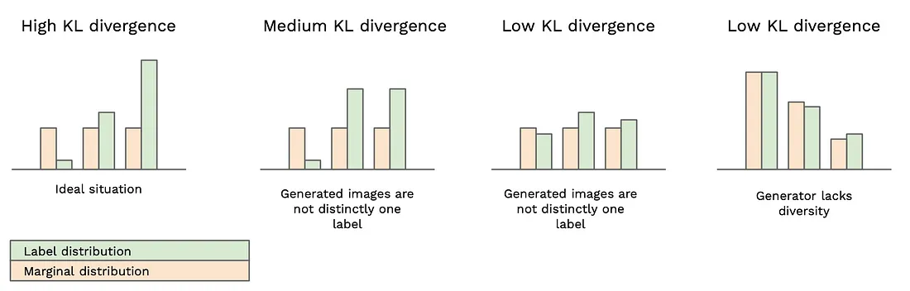

## 3.2 Fréchet Inception Distance (FID)
The **Fréchet Inception Distance (FID)** is a widely used metric for evaluating the quality of images generated by deep generative models, such as **GANs**. Unlike the **Inception Score (IS)**, which only considers the class distribution of generated images, **FID** compares the real and generated image distributions using the **Fréchet distance**.
### Mathematical Definition
The **FID** measures the difference between the feature distributions of real and generated images using the **Inception v3** network. It assumes that the deep features extracted from the penultimate layer of **Inception v3** follow a **multivariate Gaussian distribution**.
Let:
- **$\mu_r$, $\Sigma_r$​​** be the mean and covariance of real image features.
- **$\mu_g$, $\Sigma_g$​​** be the mean and covariance of generated image features.

The **FID score** is computed as:$$FID = ||\mu_r - \mu_g||^2 + \text{Tr}(\Sigma_r + \Sigma_g - 2 (\Sigma_r \Sigma_g)^{\frac{1}{2}})$$
### Intuition Behind FID
1. **Feature Representation**: Instead of raw pixels, **FID** computes statistics on high-level feature embeddings from a pre-trained **Inception v3** model.
2. **Real vs. Fake Distribution**: It compares the Gaussian approximations of real and generated image distributions.
3. **Better Than IS**: Unlike **Inception Score (IS)**, FID:
    - **Detects mode collapse** (low diversity).
    - **Penalizes poor image quality**.
    - **Is more consistent with human perception**.
### Interpretation of FID
- **Lower FID** →The generated images are **closer to real images**.
- **Higher FID** → The generated images are **far from real images** (low quality or mode collapse).
### Limitations of FID
1. **Sensitivity to Feature Extractor**: Results depend on the **Inception v3** model used for feature extraction.
2. **Gaussian Assumption**: The assumption that features follow a Gaussian distribution may not always hold.
3. **Batch Size Dependency**: FID estimates improve with a **larger number of samples**
---
# **4. Generative Adversarial Networks (GANs)**
Generative Adversarial Networks (GANs) are a class of generative models introduced by Ian Goodfellow et al. in 2014. They consist of two neural networks, a **generator** and a **discriminator**, trained in a **minimax game** setting. The generator aims to create realistic synthetic data, while the discriminator attempts to distinguish between real and generated samples. The competition between these networks results in the generator producing increasingly realistic outputs.
## 4.1 Mathematical Formulation of GANs

GANs can be understood as a two-player game where the generator G maps random noise $z \sim p_z(z)$ to the data space, producing samples $G(z).$ The discriminator D takes an input x (either real or generated) and outputs a probability $D(x)$ estimating whether the input is real $x \sim p_{\text{data}}$ or fake $x=G(z)$.

The objective function of a GAN is given by:
$$\min_G \max_D V(G, D) = \mathbb{E}_{x \sim p_{\text{data}}} [\log D(x)] + \mathbb{E}_{z \sim p_z} [\log (1 - D(G(z)))]$$
where:
- The **discriminator** tries to maximize $\log D(x) + \log (1 - D(G(z)))$, distinguishing real data $x \sim p_{\text{data}}$ from fake data $G(z)$.
- The **generator** attempts to minimize $\log (1 - D(G(z)))$, fooling the discriminator into classifying generated samples as real.

## 4.2 Intuitive Mathematical Derivation of Optimality

At **equilibrium**, the optimal discriminator is:
$$D^*(x) = \frac{p_{\text{data}}(x)}{p_{\text{data}}(x) + p_g(x)}$$
Substituting $D^*(x)$ into the loss function and simplifying, we obtain:

$$C(G) = -\log(4) + 2 \cdot \text{JSD}(p_{\text{data}} \parallel p_g)$$

where **JSD** is the [Jensen-Shannon Divergence](https://en.wikipedia.org/wiki/Jensen%E2%80%93Shannon_divergence), a measure of similarity between distributions. At optimality, **JSD is minimized**, implying $p_g \approx p_{\text{data}}$, meaning the generator has perfectly learned the data distribution.
The Jensen-Shannon Divergence (JSD) is defined as:
$$JSD(p, q) = \frac{1}{2}D_{KL}(p | m) + \frac{1}{2}D_{KL}(q | m)$$
where $m = \frac{p + q}{2}$ is the midpoint distribution.
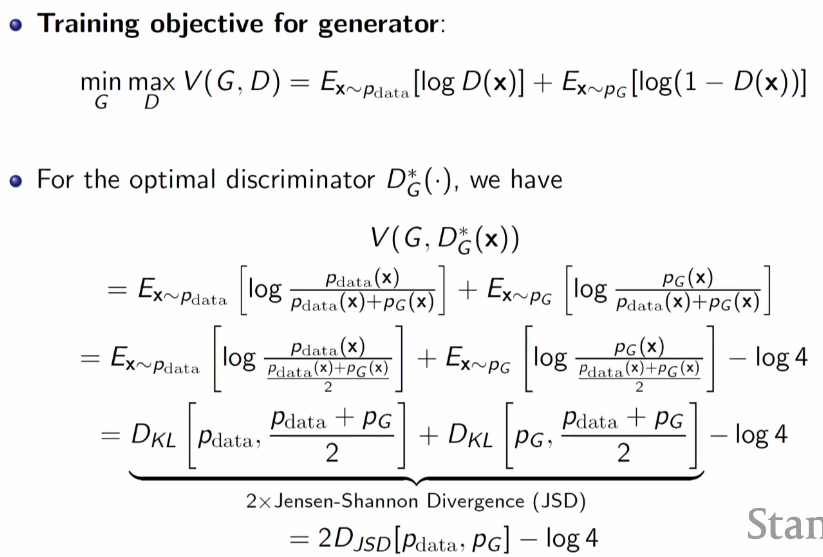
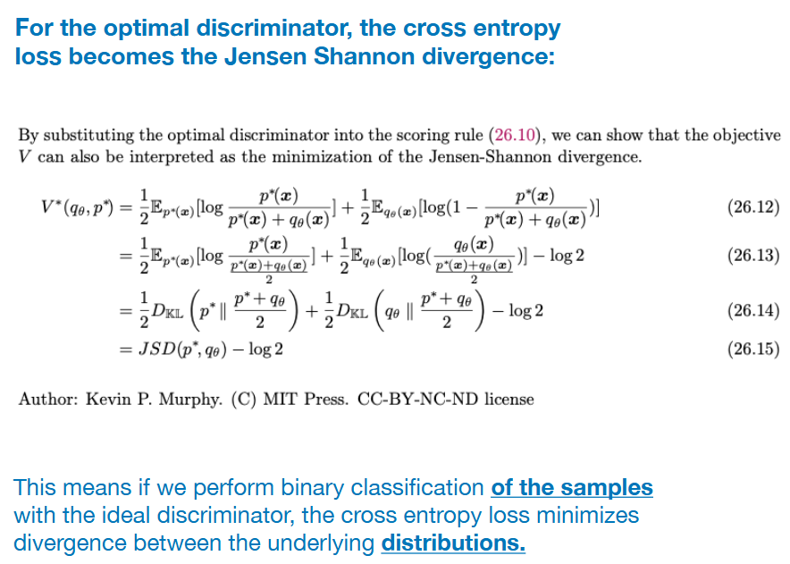
## 4.3 Training Challenges in GANs

Despite their theoretical appeal, GANs suffer from several training difficulties:

1. **Mode Collapse**: The generator produces a limited variety of samples rather than covering the full data distribution.
2. **Vanishing Gradient Problem**: If the discriminator becomes too good, $D(G(z)) \approx 0$, leading to near-zero gradients for the generator.
3. **Unstable Training**: GANs involve a delicate balance between the generator and discriminator, often leading to oscillations or divergence.
4. **Evaluation Metrics**: There is no direct likelihood estimation in GANs, making performance assessment difficult.
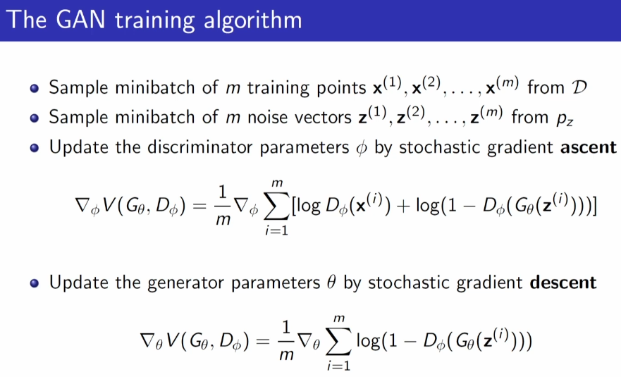
## 4.4 Modified Generator Loss for Numerical Stability in GANs
The generator G is trained to minimize:

$$\mathbb{E}_{z \sim p_z} [\log (1 - D(G(z)))]$$
### **Why This Loss Causes Problems**

- When training starts, $D(G(z))$ is close to **0** since the generator is weak.
- This makes $\log(1 - D(G(z)))$ approach **$\log(1) = 0$**, leading to **vanishing gradients**.
- The generator receives very weak updates, making learning inefficient.
### **The Solution: Modified Generator Loss**

Instead of minimizing $\log(1 - D(G(z)))$, we **flip the loss** and maximize $\log D(G(z))$
which is equivalent to:
$$\min_G -\mathbb{E}_{z \sim p_z} [\log D(G(z))]$$
### **Why This Works Better**
- Instead of trying to **minimize a nearly zero value** (which results in weak gradients), the generator now **maximizes** $D(G(z))$, which starts small but increases as training progresses.
- The gradients from $\log D(G(z))$ are much stronger when $D(G(z))$ is small, leading to **faster convergence**.
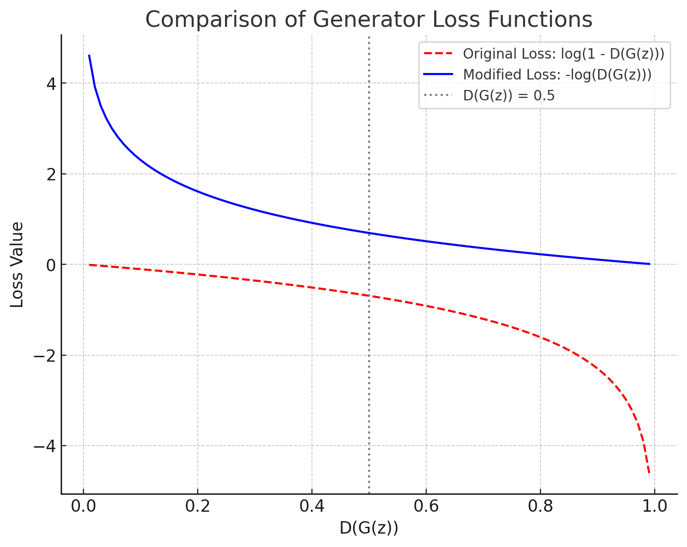
- The **red dashed curve** represents the original loss $\log(1 - D(G(z)))$.
    - When $D(G(z))$ is **small**, the loss is nearly **zero**, causing weak gradients and slow learning.
    - The loss only changes significantly when $D(G(z))$ is **large**, which rarely happens early in training.
- The **blue solid curve** represents the modified loss $-\log D(G(z))$.
    - When $D(G(z))$ is **small**, the loss is **high**, leading to stronger gradients and better learning.
    - This ensures that the generator updates even when $D(G(z))$ is close to zero.

## 4.5 **[Improved Training Techniques](zotero://open-pdf/library/items/K5K9PC9V?page=2)**

### 1. Feature Matching
Instead of directly optimizing the generator to fool the discriminator, feature matching uses **intermediate representations** from the discriminator:

$$\min_G \| \mathbb{E}_{x \sim p_{\text{data}}} f(x) - \mathbb{E}_{z \sim p_z} f(G(z)) \|_2^2$$

where $f(x)$ are features extracted from a hidden layer of D. This prevents mode collapse by encouraging generated data to match real data statistics.
### 2. Minibatch Discrimination
Instead of evaluating samples **independently**, minibatch discrimination considers groups of samples and penalizes generators that produce **similar samples**:
$$D(x) = D(x, M(x))$$
where $M(x)$ represents **minibatch statistics**. This forces the generator to diversify outputs and mitigates mode collapse.
### 3. Label Smoothing
Rather than using **hard labels** (0 for fake, 1 for real), label smoothing replaces them with **soft values** (e.g., 0.9 for real and 0.1 for fake). This prevents the discriminator from becoming **overconfident**, leading to better gradient flow.
### 4. Historical Averaging
Historical averaging smooths parameter updates by maintaining a running average of past gradients. This can reduce instability in training and help convergence. By discouraging drastic updates, historical averaging prevents rapid shifts in network behavior, leading to smoother convergence.
$$R(\theta) = \lambda \|\theta - \frac{1}{t} \sum_{i=1}^{t} \theta_i \|^2$$
### 5. Virtual Batch Normalization
Virtual batch normalization normalizes each sample using statistics computed from a fixed reference batch, improving stability and reducing mode collapse.
$$\hat{x}_i = \frac{x_i - \mu_v}{\sigma_v}$$
## Sampling
Sampling from a GAN is straightforward:
1. Sample $z \sim p(z)$ (typically $\mathcal{N}(0, I)$)
2. Pass through the generator: $x = G(z)$
## Density Estimation
Standard GANs don't provide a way to evaluate input probability $p(x)$ directly, as they only learn the generator mapping. There are a few approaches to approximate this such as **Kernel Density Estimation**: Generate many samples and fit a KDE to estimate density.

---
# **5. Autoregressive Generative Models**

Autoregressive generative models are a class of probabilistic models used to generate sequential data by modeling the conditional probability distribution of each element in the sequence given the previous elements. The core idea is to factorize the joint probability distribution of a sequence into a product of conditional probabilities, leveraging the chain rule of probability.

## 5.1 Definition and Formulation
Given a high-dimensional data instance $\mathbf{x} = (x_1, x_2, \dots, x_D)$, an autoregressive model represents the joint probability distribution as a product of conditional distributions:
$$p(\mathbf{x}) = \prod_{d=1}^{D} p(x_d|x_{< d}) = p(x_1) p(x_2 \mid x_1) p(x_3 \mid x_1, x_2) \dots p(x_D \mid x_1, x_2, \dots, x_{D-1})$$
where $x_{< d}​=(x1​,x2​,…,x_{d-1}​)$ represents the history of the sequence up to dimension d−1.
In practical implementations, these conditional probabilities are typically parameterized using deep neural networks, such as recurrent neural networks (RNNs), transformers, or convolutional architectures.
## Making Intractable Distributions Tractable
Autoregressive models offer a way to make intractable distributions tractable by:
1. **Factorization**: Breaking down complex joint distributions into simpler conditional distributions $$p(x) = \prod_{i=1}^{n} p(x_i|x_{< i})$$
2. **Tractable conditionals**: Each conditional probability $p(x_i|x_{< i})$ can be modeled by tractable distributions or using a neural network.
This approach allows you to work with distributions that would otherwise be intractable.

## 5.2 Key Properties of AR Models
1. **Sequential Dependency Structure**: AR models explicitly capture temporal or sequential dependencies in data, making them ideal for tasks where element ordering is critical (e.g., language modeling, time series forecasting). Each element is generated conditionally on previously generated elements.
2. **Explicit Probabilistic Framework**: Unlike implicit generative models such as GANs, AR models provide exact likelihood computation through an explicit probability distribution: p(x) = $\prod_{i=1}^{n} p(x_i | x_{< i})$ This makes them particularly valuable for probabilistic inference, uncertainty quantification, and density estimation tasks.
3. **High Expressive Capacity with Trade-offs**: AR models can represent complex dependencies between variables by conditioning each element on all preceding elements, potentially capturing long-range dependencies. However, this expressive power comes with computational costs:
## 5.3 Drawbacks of AR Models
1. **Sequential Generation Process**: The inherently step-by-step generation process (sampling $x_i$​ after $x_{< i}$) limits parallelization and can become a bottleneck for high-dimensional data. (Doesn't scale up 😔)
2. **Choice of order induces a bias**: In AR models, you must choose a specific order for the variables, which can introduce modeling bias. For example, in image generation, deciding whether to generate pixels left-to-right, top-to-bottom, or in another pattern affects what dependencies the model can easily capture.	
3. **No "direct" feature learning**: Unlike models that learn latent representations (like VAEs or GANs), standard AR models don't automatically learn compressed feature representations of the data. They model the direct relationships between observed variables rather than learning abstract features.
## 5.4 Autoregressive Generative Models: From Simple to Advanced

### [FVSBN & NADE](https://deepgenerativemodels.github.io/notes/autoregressive/)
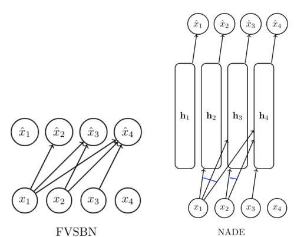
### MADE (Masked/autoregressive AE)
MADE is a **feedforward neural network** that estimates the probability distribution of input x while enforcing an autoregressive property using **masked connections**. MADE uses a **fully connected autoencoder-like structure** but applies **masks** to enforce autoregressive dependencies $W' = W \odot M$.

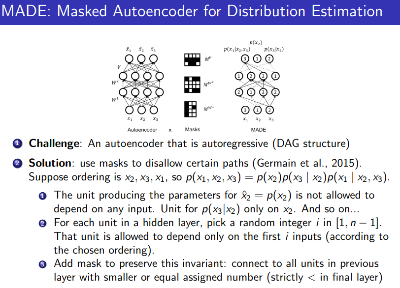
#### Advantages
✅ **Autoregressive**: Ensures valid probability distributions.  
✅ **Efficient**: Trains with a single forward pass (unlike NADE, which requires D passes).  
✅ **Scalable**: Can use deep networks with multiple layers for complex dependencies.
#### Challenges
⚠ **Order dependence**: Different orderings lead to different models, requiring averaging techniques.  
⚠ **No parallel generation**: Sampling remains **sequential**.
### PixelRNN (sequential)
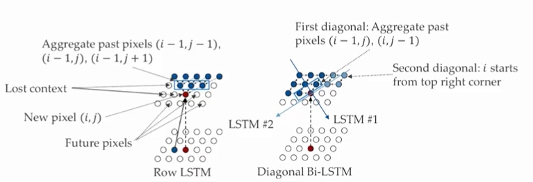
### PixelCNN (parallel)
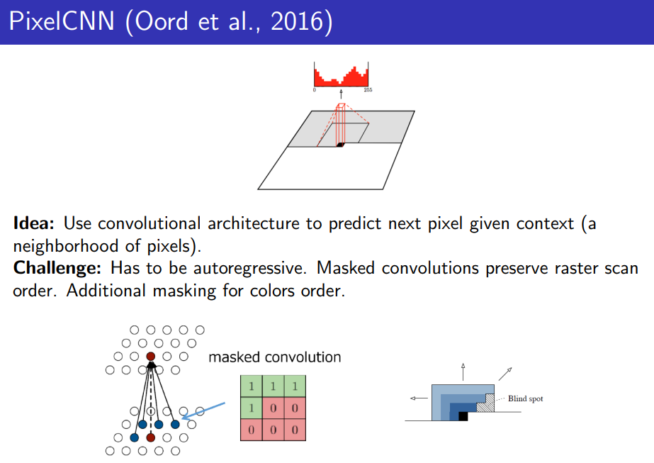
### WaveNet (Dilated convolutions)
Traditional autoregressive models (like **PixelRNN**) suffer from **sequential dependencies**, making training and inference **slow**. Instead, **WaveNet uses dilated convolutions**, allowing it to:
- Model **long-range dependencies** efficiently.
- Perform **parallel processing** during training.
- **Increase receptive field** exponentially without increasing computational cost significantly.
#### Dilated Convolutions
Dilated convolutions **solve the limited receptive field issue** by introducing **gaps (dilations)** between kernel elements.  
The dilation rate **doubles** at each successive layer, exponentially increasing the receptive field.
#### Mathematical Definition
For a **1D convolution**, the output at time step t is:$$y[t] = \sum_{i=0}^{k-1} w[i] \cdot x[t - d \cdot i]$$
where:
- k is the kernel size,
- d is the **dilation rate**,
- $w[i]$ are the filter weights.
#### Receptive Field Growth
With **L layers** and kernel size k, the receptive field is:$$R = 1 + (k - 1) \sum_{l=0}^{L-1} 2^l$$

For **L=10**, **k=2:** $$R = 1 + (2 - 1) \sum_{l=0}^{9} 2^l = 1 + (2^{10} - 1) = 1024$$ Thus, only 10 layers can cover 1024 samples, making the model highly efficient.
<figure style="text-align:center;">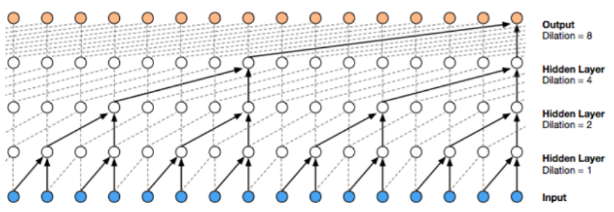<figcaption style="text-align:center;">Dilated Convolutions</figcaption></figure>

### Sampling
In autoregressive models, sampling is sequential:
1. Sample $x_1 \sim p(x_1)$
2. For $i = 2$ to $n$: Sample $x_i \sim p(x_i|x_1,\ldots,x_{i-1})$
*The key insight is that $x_1​$ is special because it needs an unconditional distribution $p(x_1)$. Many autoregressive models have a special case for handling this first element.*
### Density Estimation
This is a key strength of autoregressive models. The probability of a sequence $x = (x_1, x_2, ..., x_n)$ is: $$p(x) = \prod_{i=1}^{n} p(x_i|x_1,\ldots,x_{i-1})$$To evaluate the probability of an input:
1. Decompose using the chain rule: $p(x) = p(x_1) \cdot p(x_2|x_1) \cdot p(x_3|x_1,x_2) \cdots$
2. For each conditional probability, feed the context into the model and extract the probability assigned to the actual next token/value *(Ideally can be done in a single forward pass except for PexilRNN)*

---
# [**6. Normalizing Flows**](https://deepgenerativemodels.github.io/notes/flow/#fnref:nf)
Flow-based generative models are a class of likelihood-based generative models that explicitly learn the data distribution by applying a sequence of invertible transformations to a simple base distribution (like a Gaussian). These transformations allow for exact likelihood computation and efficient sampling.
The core idea of flow-based models is to transform a **complex data distribution** into a **simple one** (and vice versa) using **a sequence of invertible mappings**. These mappings allow for easy computation of the probability density of any data point while also enabling direct sampling.
Mathematically, this transformation is achieved through a **bijective function** f with an **invertible Jacobian**.
###### bijective function
A bijective function, also known as a bijection or one-to-one correspondence, is a function that is both injective (one-to-one) and surjective (onto). In simpler terms, a function f: A → B is bijective if:
1. Every element in the codomain B is mapped to by exactly one element from the domain A.
2. Each element of A is paired with a unique element of B, and every element of B is paired with a unique element of A.
Key properties of bijective functions include:
1. Invertibility: A bijective function has an inverse function that maps each element in B back to its unique preimage in A.
2. Composition: The composition of two bijections is also a bijection.
To determine if a function is bijective, it must pass both the vertical line test (for injectivity) and the horizontal line test (for subjectivity), while also covering all elements of the codomain.

## 6.1 Key Mathematical Formulation

Given a data point $x∈R^D$ in a high-dimensional space, the model transforms it into a latent variable $z∈R^D$ using an invertible and differentiable function $$f:R^D→R^D \text{ such that } x=f(z) \text{ and } z=f^{-1}(x).$$
where $z$ follows a known prior distribution (e.g., Gaussian $p_Z(z)$).
By using the **[[Change of Variables]] formula**, we can compute the density of $x$ as:

$$p_X(x) = p_Z(f^{-1}(x)) \left| \det \frac{\partial f}{\partial x} \right|^{-1}$$
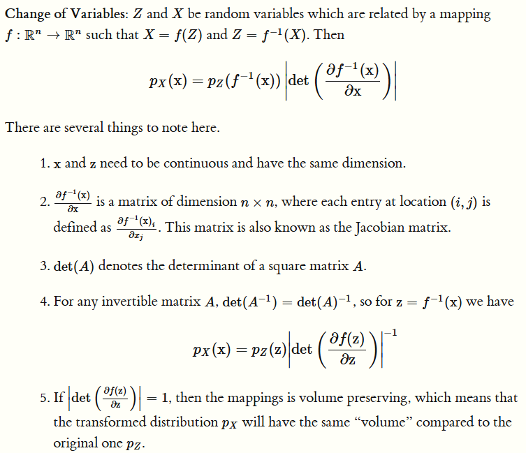
#### **Composition of Flows**
The transformation $f$ is typically composed of multiple simpler transformations $f=f_{1}​∘f_{2}​∘⋯∘f_{L}$​, where each $f_{i}$​ is invertible and differentiable. The likelihood of the data under the model becomes:
$$p_X(x) = p_Z(f^{-1}(x))   \prod_{i=1}^{L} \left| \det \frac{\partial f_{i}(x)}{\partial x} \right|^{-1}$$

Each flow $f_{i}$ is designed to be computationally efficient, with an easy-to-compute Jacobian determinant.
#### Training Objective
Flow-based models are trained by maximizing the log-likelihood of the data:
$$\log p_X(x) = \log p_Z(f^{-1}(x)) +  \sum_{i=1}^{L} \log \left| \det \frac{\partial f_{i}^{-1}(x)}{\partial x} \right|$$

This objective encourages the model to learn transformations that map the data distribution to the prior distribution while maintaining efficient computation of the likelihood.
## 6.2 Key Properties
1. **Exact Likelihood Computation**: Unlike GANs (which lack an explicit density function) and VAEs (which approximate likelihood), flow models compute likelihoods **exactly** (*tractable*) using invertible mappings.
2. **Efficient Inverse Transformations**: Unlike autoregressive models (which generate samples sequentially), flow models allow for **parallel sampling** because they transform an entire data vector at once.
3. **Bijectivity & Expressivity Tradeoff**: Flow models require **invertible** and **efficiently computable** transformations, limiting their expressivity compared to VAEs or GANs, which can use arbitrary neural networks.
4. Different from autoregressive model and variational autoencoders, deep normalizing flow models require specific architectural structures:
	1. The input and output dimensions must be the same.
	2. The transformation must be invertible.
	3. Computing the determinant of the Jacobian needs to be efficient (and differentiable).
### Dimensionality Must Remain the Same
1. **Invertibility Requirement:**  
    Flow-based models use bijective (one-to-one and onto) transformations $f:R^D→R^D$. For a transformation to be invertible, the input and output spaces must have the same dimensionality.
2. **Change of Variables Formula:**  
    the **Jacobian matrix**, defined as:
$$J_f(x) = \frac{\partial z}{\partial x} = \begin{bmatrix} \frac{\partial z_1}{\partial x_1} & \cdots & \frac{\partial z_1}{\partial x_n} \\ \vdots & \ddots & \vdots \\ \frac{\partial z_n}{\partial x_1} & \cdots & \frac{\partial z_n}{\partial x_n} \end{bmatrix}$$
	For the transformation to be valid:
	- The Jacobian matrix must be **square** ($n \times n$) so that its determinant exists.
	- If $dim⁡(z)≠dim⁡(x)$, then $J_f(x)$ is either not square or not full-rank, making it **non-invertible**.
    
3. **Volume Preservation (or Non-Preservation):**  
    The total probability must remain **conserved** under transformation:$$\int P(x) dx = \int P(z) dz = 1$$If $\dim(z) \neq \dim(x)$, the differential volume element changes incorrectly, disrupting probability conservation.
	For example:
	- If $dim(z) < dim(x)$, we are losing information and cannot properly redistribute probability mass.
	- If $dim(z) > dim(x),$ we are creating additional degrees of freedom, violating normalization.
## 6.3 Normalizing Flow Models
The Nonlinear Independent Components Estimation (NICE) model and Real Non-Volume Preserving (RealNVP) model composes two kinds of invertible transformations: additive coupling layers and rescaling layers.
### (a) NICE (Nonlinear Independent Components Estimation)
NICE is based on the idea of transforming a simple distribution (e.g., Gaussian) into a complex one through a series of invertible and differentiable mappings.
The change of variables formula simplifies to: $$\log p_X(x) = \log p_Z(f(x))$$
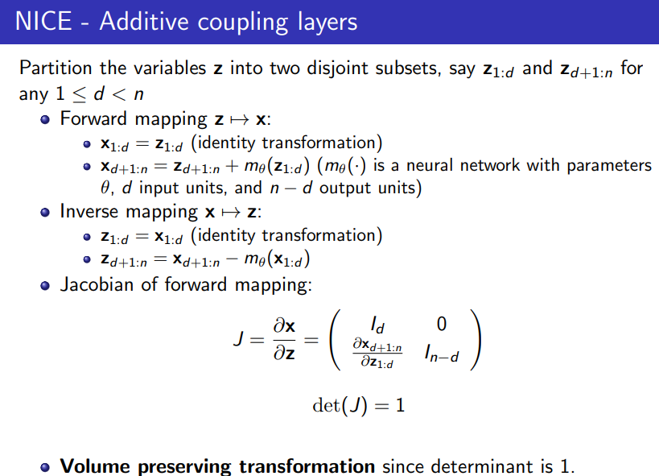
### (b) RealNVP (Real-valued Non-Volume Preserving)
RealNVP extends NICE by allowing non-volume-preserving transformations, which enables more flexible modeling of complex distributions. It uses affine coupling layers to introduce scaling and translation operations, making the transformations more expressive.
#### Forward Transformation
Instead of an **additive** coupling layer, RealNVP introduces an **affine** transformation: $$z_1 = x_1, \quad z_2 = x_2 \odot \exp(s(x_1)) + t(x_1)$$
where $s(x_1)$ (scale) and $t(x_1)$ (translation) are learned functions.
#### Inverse Transformation
$$x_1 = z_1, \quad x_2 = (z_2 - t(x_1)) \odot \exp(-s(x_1))$$
This is still efficient because elementwise multiplication and addition are easily invertible. The log-likelihood is: $$\log p_X(x) = \log p_Z(f(x)) - \sum_i s_i(x_1)$$
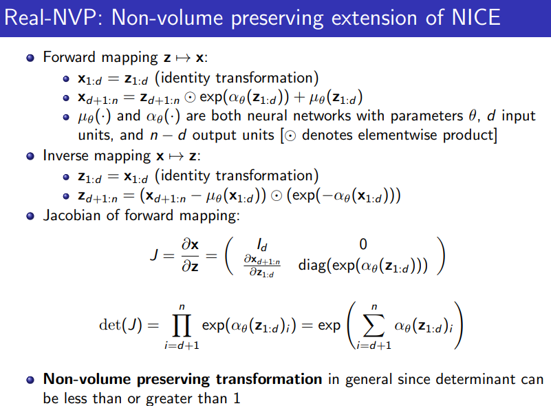

### (c) **[Glow (Generative Flow)](https://lilianweng.github.io/posts/2018-10-13-flow-models/#glow)**
### Sampling
To generate a new sample from $p_X(x)$, we **sample from the latent space** and apply the inverse transformation.
1. **Sample from the prior distribution** $p_Z(z)$: $z \sim \mathcal{N}(0, I)$
2. **Apply the inverse flow transformation** $f^{-1}$ to obtain x: $x = f^{-1}(z)$
### Density Estimation
Given a data sample x, we want to compute the log-likelihood: $$\log p_X(x) = \log p_Z(f(x)) + \log \left| \det J_f(x)^{-1} \right|$$
1. **Encode x into z:** $$z = f(x)$$
2. **Evaluate the prior density $p_Z(z)$:** $$p_Z(z) = \mathcal{N}(z \mid 0, I) = \frac{1}{(2\pi)^{d/2}} \exp \left( -\frac{1}{2} \|z\|^2 \right)$$
3. **Compute the log-determinant of the Jacobian $J_f(x)$:** $$\log |\det J_f(x)| = \sum_{i=1}^{L} \log |\det J_{f_i}(x)|$$
    (where $L$ is the number of transformations in the flow).
4. **Compute the log-likelihood:** $$\log p_X(x) = \log p_Z(f(x)) + \sum_{i=1}^{L} \log |\det J_{f_i}(x)|$$This allows us to evaluate how **probable** a given x is under the learned distribution.
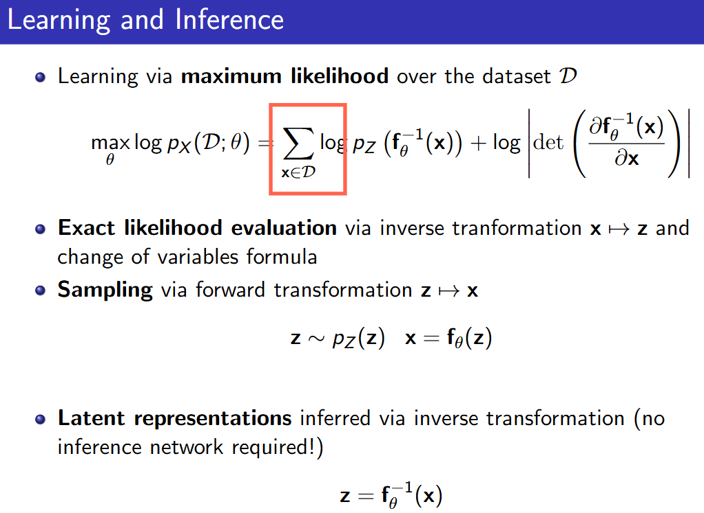
---
# **[7. Score Based (Diffusion Models)](https://lilianweng.github.io/posts/2021-07-11-diffusion-models/)**
blogs:
https://lilianweng.github.io/posts/2021-07-11-diffusion-models/
https://codoraven.com/blog/ai/stable-diffusion-clearly-explained/
https://jalammar.github.io/illustrated-stable-diffusion/

Diffusion models are generative models that learn to generate data by gradually denoising a sample from a simple prior distribution (like a Gaussian noise).
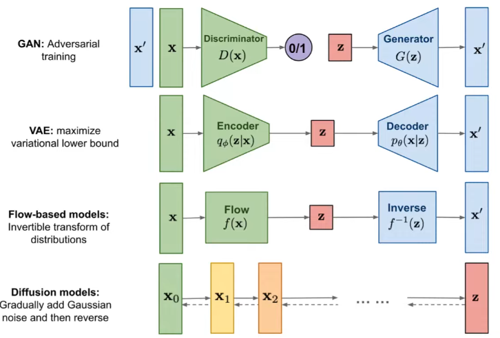
### **7.1 Forward Diffusion Process

We take a data sample $x_0 \sim q(x)$ and gradually add Gaussian noise over **T discrete time steps**. This transforms the data into a pure Gaussian noise sample. The process follows a **Markov chain**, meaning each step only depends on the previous one: $$q(x_t | x_{t-1}) = \mathcal{N}(x_t; \sqrt{1 - \beta_t} x_{t-1}, \beta_t I)$$where:
- $\beta_t$ is a small noise variance schedule (e.g., increasing over time).
- $x_t$ is the noisy version of $x_0$ at time t.

By applying this for **T steps**, we can express $x_t$ directly in terms of $x_0$ and noise $\epsilon \sim \mathcal{N}(0, I)$: $$q(x_t | x_0) = \mathcal{N}(x_t; \sqrt{\bar{\alpha}_t} x_0, (1 - \bar{\alpha}_t) I)$$where: $$\alpha_t = 1 - \beta_t, \quad \bar{\alpha}_t = \prod_{s=1}^{t} \alpha_s$$This means we can sample any $x_t$​ in one step instead of iterating, using: $$x_t = \sqrt{\bar{\alpha}_t} x_0 + \sqrt{1 - \bar{\alpha}_t} \epsilon$$where $\epsilon \sim \mathcal{N}(0, I)$ is **pure noise**.
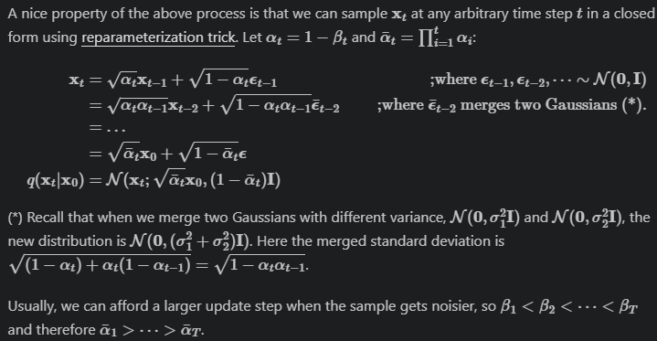
### **7.2 Reverse Process (Denoising to Generate Samples)**

The key idea of diffusion models is learning to **reverse this process** to recover clean data from noise. If we knew the true posterior: $$q(x_{t-1} | x_t, x_0) = \mathcal{N}(x_{t-1}; \tilde{\mu}_t(x_t, x_0), \tilde{\beta}_t I)$$where: $$\tilde{\mu}_t(x_t, x_0) = \frac{\sqrt{\bar{\alpha}_{t-1}} \beta_t}{1 - \bar{\alpha}_t} x_0 + \frac{\sqrt{\alpha_t} (1 - \bar{\alpha}_{t-1})}{1 - \bar{\alpha}_t} x_t$$ $$\tilde{\beta}_t = \frac{1 - \bar{\alpha}_{t-1}}{1 - \bar{\alpha}_t} \beta_t$$we could **sample backwards** from pure noise to reconstruct $x_0$​.
### **Estimating the Reverse Process**
Since $x_0$​ is unknown, we train a neural network (e.g., U-Net) to approximate the mean $\mu_\theta(x_t, t)$ and noise $\epsilon_\theta(x_t, t)$. The reverse step is modeled as: $$p_\theta(x_{t-1} | x_t) = \mathcal{N}(x_{t-1}; \mu_\theta(x_t, t), \sigma_t^2 I)$$where: $$\mu_\theta(x_t, t) = \frac{1}{\sqrt{\alpha_t}} \left( x_t - \frac{\beta_t}{\sqrt{1 - \bar{\alpha}_t}} \epsilon_\theta(x_t, t) \right)$$
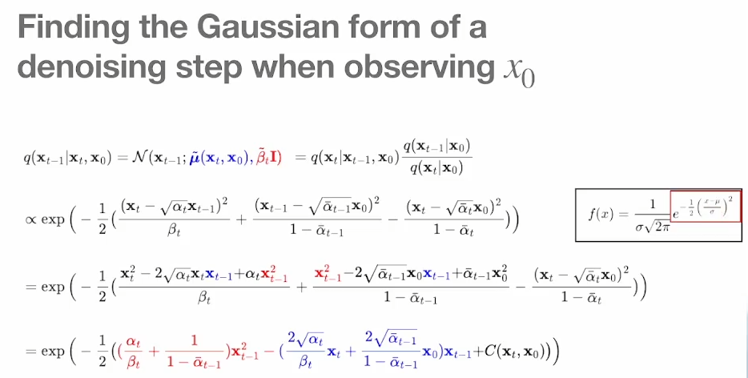
$$\left( \frac{x - \mu}{\sigma} \right)^2 = \color{red}\left( \frac{x^2}{\sigma^2} \right) + \color{blue}\frac{2 \mu x}{\sigma^2} + \color{white}\frac{\mu^2}{\sigma^2}$$
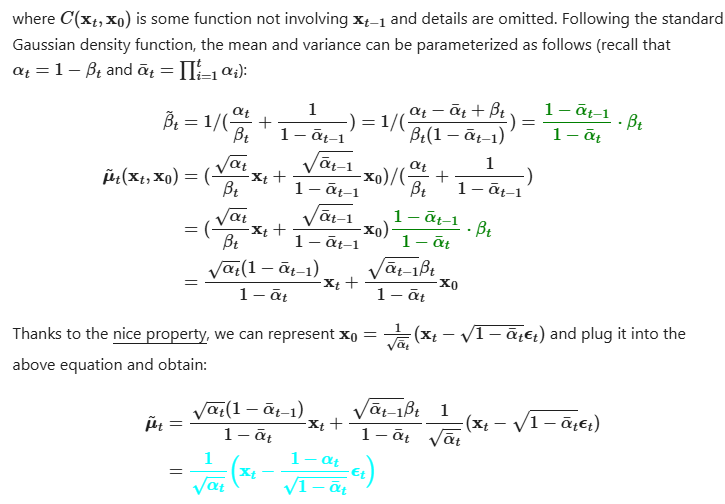
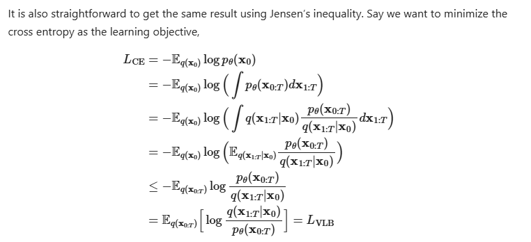
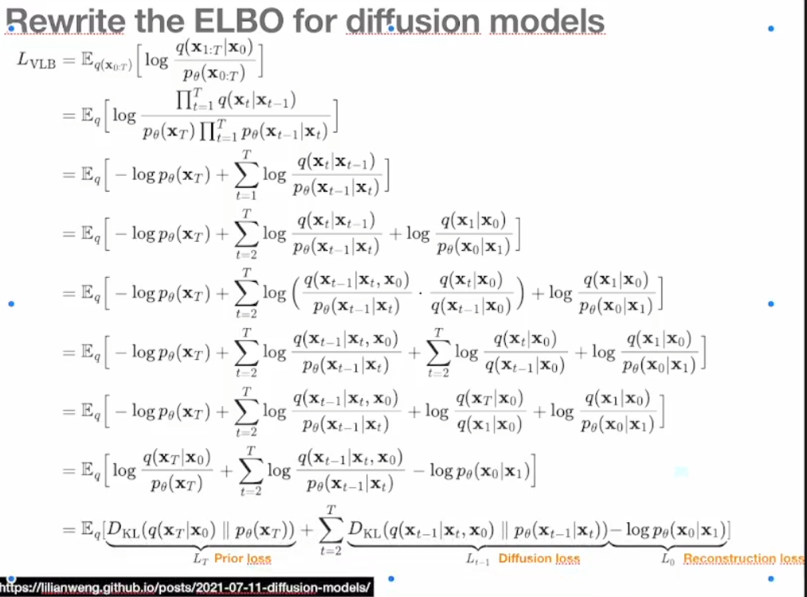

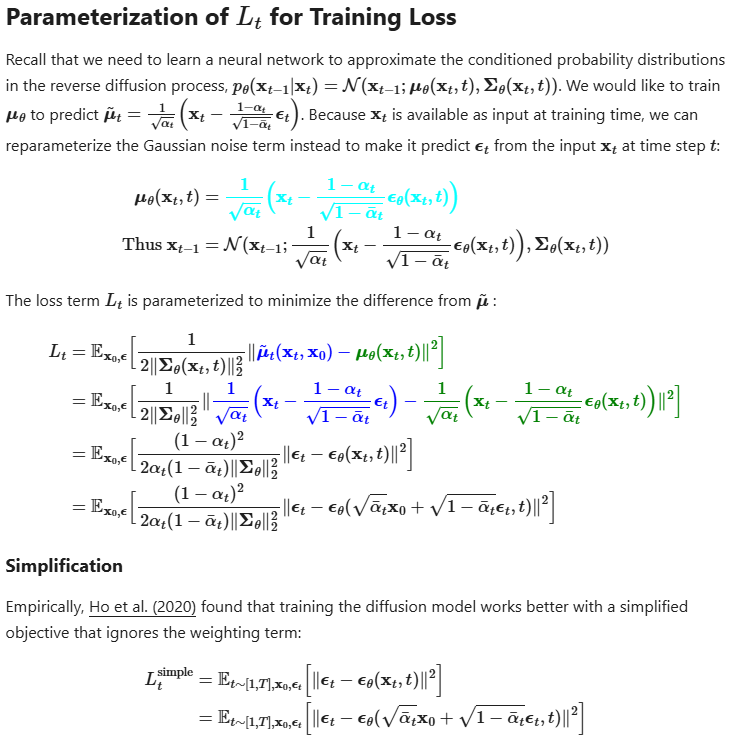

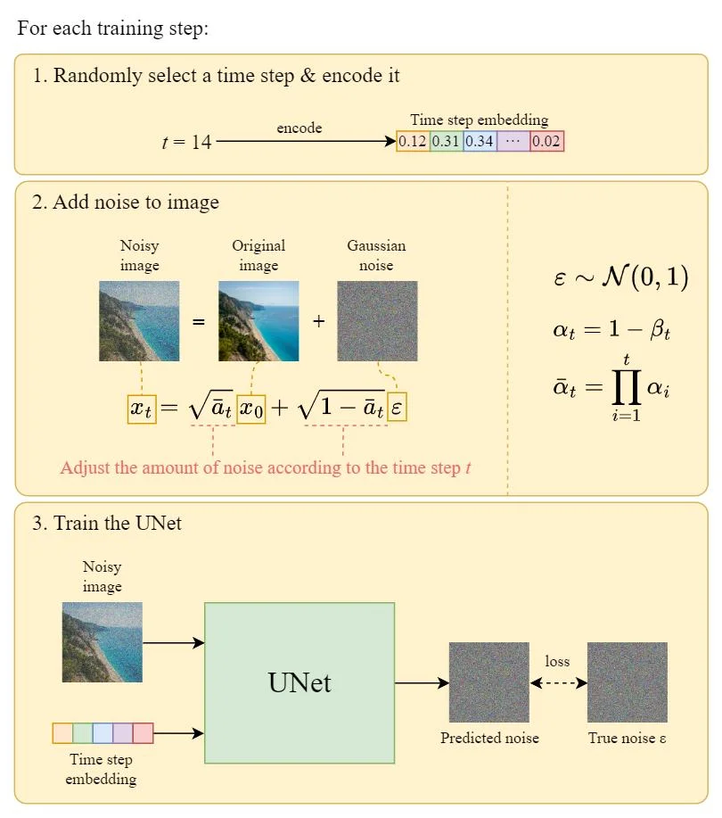
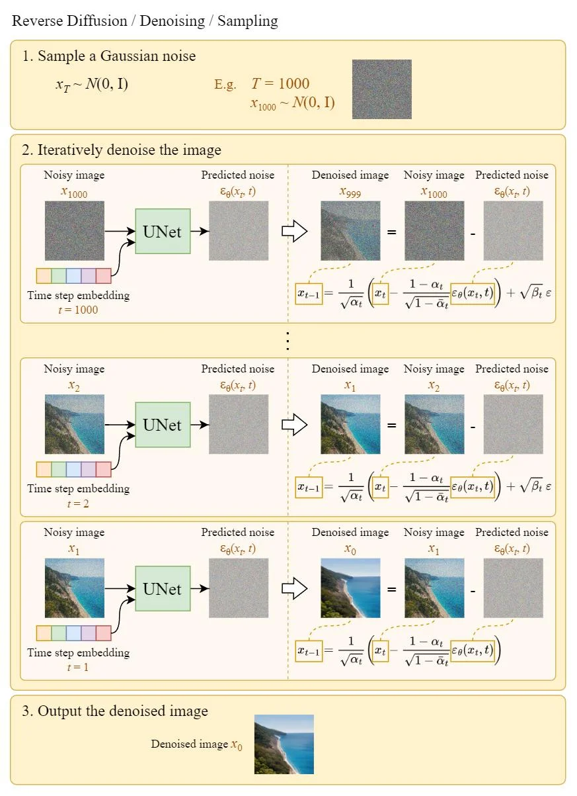
# 7.3 Speed up Diffusion Models
It is very slow to generate a sample from DDPM by following the Markov chain of the reverse diffusion process, as T can be up to one or a few thousand steps.
### Latent Diffusion Model
_Latent diffusion model_ (**LDM**; [Rombach & Blattmann, et al. 2022](https://arxiv.org/abs/2112.10752)) runs the diffusion process in the latent space instead of pixel space, making training cost lower and inference speed faster. It is motivated by the observation that most bits of an image contribute to perceptual details and the semantic and conceptual composition still remains after aggressive compression.
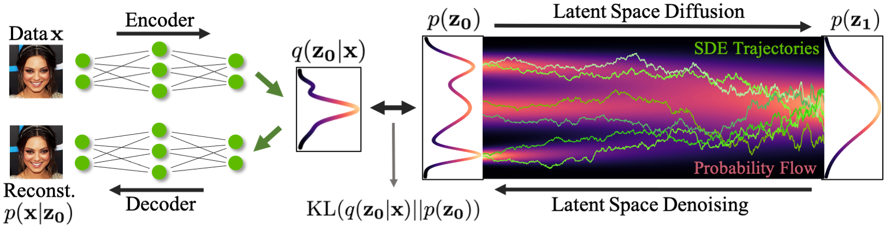
#### ✅ **Pros:**
- Generates **high-quality samples**, often **outperforming GANs** in fidelity and diversity.
- **Stable training**, unlike GANs, which suffer from mode collapse.
- **No adversarial training** → avoids discriminator-generator instability.
- Can model complex **multi-modal distributions** better than GANs.
#### ❌ **Cons:**
- **Slow inference** (requires hundreds of denoising steps to generate a sample).
- Computationally expensive due to iterative refinement.
- Hard to interpret mathematically compared to VAEs and normalizing flows.
#### 🔄 **Hidden Similarities:**
- Similar to **VAEs**, diffusion models optimize a **variational bound** on likelihood.
- Like **autoregressive models**, DMs generate samples **step-by-step**, but in a stochastic way.
- Similar to **flow models**, they learn a **sequence of transformations** from simple noise to data.
